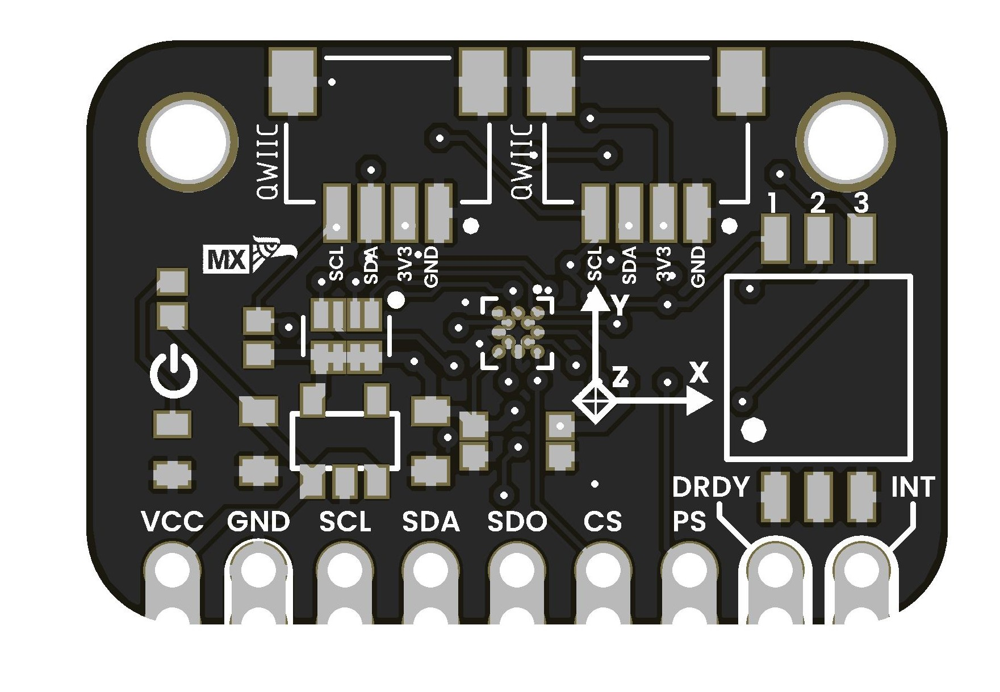

# Magnetometer BMM150

## Introduction
The **BMM150** is a compact, ultra-low-power 3-axis digital magnetometer. It’s ideal for electronic compass applications, inertial navigation, and orientation sensing in embedded devices. With both I²C and SPI interfaces, it integrates seamlessly with platforms like Arduino, ESP32, Raspberry Pi, and more.

<a href="#">  Magnetometer BMM150</a>

---

## Key Features
- **Axes:** 3 (X, Y, Z)  
  
- **Measurement Range:** ±1300 µT  
- **Resolution:** ~0.3 µT  
- **Power Consumption:**   
- **Interfaces:**  
- **Supply Voltage:** 3.3 V  
- **Operating Temperature:** 
- **Additional Signals:**  
  - **DRDY** (Data Ready)  
  - **INT** (Programmable Interrupt)  
  - **SDO/ADDR** (I²C address select / SPI MISO)

---

## Aplications

| Application                           | Brief Description                                                                                 |
| ------------------------------------- | ------------------------------------------------------------------------------------------------- |
| Electronic compass                    | Detection of Earth’s magnetic field to determine device orientation (north).                      |
| Inertial navigation (INS)             | Complements accelerometer and gyroscope for position and orientation estimation in navigation.    |
| Augmented reality (AR)                | Dynamically adjusts AR content on smartphones or tablets based on device orientation.             |
| Metal detection / proximity sensing   | Monitors magnetic field variations to detect metallic objects or anomalies in machinery.          |
| Mobile robotics and drones            | Provides heading guidance and correction for autonomous robots and drones, especially indoors.    |
| Wearables and portable devices        | Tracks direction and orientation in smartwatches, fitness bands, and personal navigation devices.|
| Indoor geolocation                    | Corrects drift and improves accuracy in indoor positioning systems.                               |
