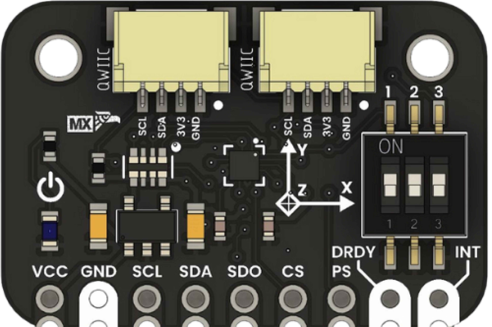

# Magnetometer BMM150

## Introduction
The BMM150 is a compact, low-power triaxial geomagnetic sensor from Bosch Sensortec. It delivers precise magnetic field measurements on three axes and supports I²C/SPI interfaces for easy integration with platforms like Arduino, ESP32, and Raspberry Pi. Its built-in compensation algorithms and support for sensor fusion make it ideal for navigation, robotics, and wearable applications.

 <a href="https://unit-electronics-mx.github.io/wiki_uelectronics/docs/Sensors/bmm150" target="_blank">   Magnetometer BMM150 </a> 

## Additional Resources

| Resource | Link |
|:--------:|:----:|
| Wiki-UNIT Electronics | [Wiki - UNIT Electronics](https://unit-electronics-mx.github.io/wiki_uelectronics/es/docs/Sensors/bmm150/) |
| Github Repository | [Github Repository](https://github.com/UNIT-Electronics-MX/unit_bmm150_magnetometer) |
| Product Brief | [Product brief](https://unit-electronics-mx.github.io/unit_bmm150_magnetometer/datasheet_professional.html) |
| Schematic | [Schematic](https://unit-electronics-mx.github.io/unit_bmm150_magnetometer/unit_sch_V_0_0_1_ue0066_bmm150_magnetometro.pdf) |

## Key Features
- **Axes:** 3 (X, Y, Z)
- **Measurement Range:** ±1300 µT
- **Resolution:** ~0.3 µT
- **Power Consumption:** Ultra-low power consumption for battery-operated devices
- **Interfaces:** I²C and SPI
- **Operating Voltage (VDD / VDDIO):** 3.3 V (regulated internal voltage for sensor operation)  
- **Input Voltage via VCC Pin:** 3.6–6.0 V (through onboard voltage regulator)
- **Operating Temperature:** Wide operating range suitable for various environments
- **Additional Signals:**  
  - **DRDY** (Data Ready)  
  - **INT** (Programmable Interrupt)  

⚠️ Note: The VCC pin is connected to an onboard LDO voltage regulator. Supplying 3.3V directly to the 3V3 pin bypasses the regulator.

## Applications

| Application                           | Description                                                                                       |
| ------------------------------------- | ------------------------------------------------------------------------------------------------- |
| Electronic Compass                    | Detects Earth’s magnetic field to determine the device orientation.                             |
| Inertial Navigation (INS)             | Integrates with accelerometers and gyroscopes to improve position and orientation estimation.    |
| Augmented Reality (AR)                | Dynamically adjusts AR content on smart devices based on precise orientation data.                |
| Metal Detection / Proximity Sensing   | Monitors magnetic field variations to detect metallic objects and machinery anomalies.           |
| Mobile Robotics and Drones            | Provides reliable heading information, essential for indoor navigation and autonomous operation. |
| Wearables and Portable Devices        | Enhances personal navigation in smartwatches, fitness trackers, and other portable devices.        |
| Indoor Geolocation                    | Improves indoor positioning accuracy by compensating for sensor drift and interference.          |

## Documentation and Setup

## Support
For any issues or further assistance, please open an issue on the GitHub repository or contact our support team.

## License
This project is licensed under the MIT License - see the [LICENSE](LICENSE) file for details.

