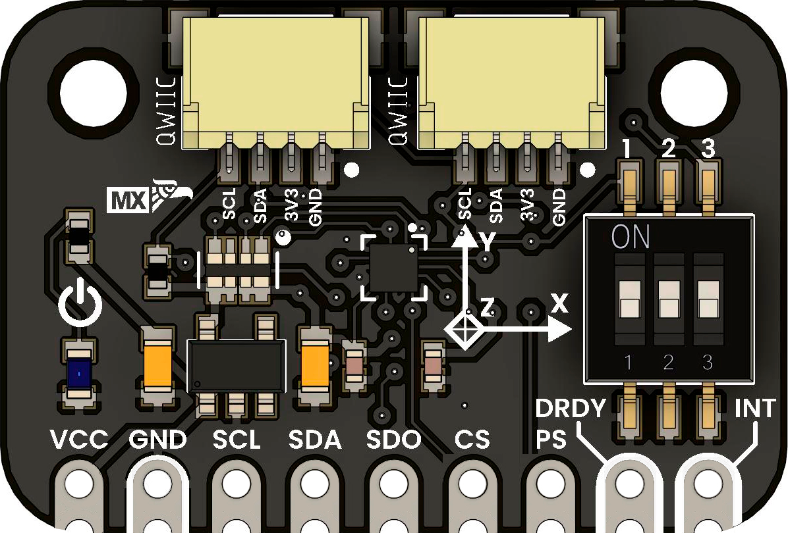
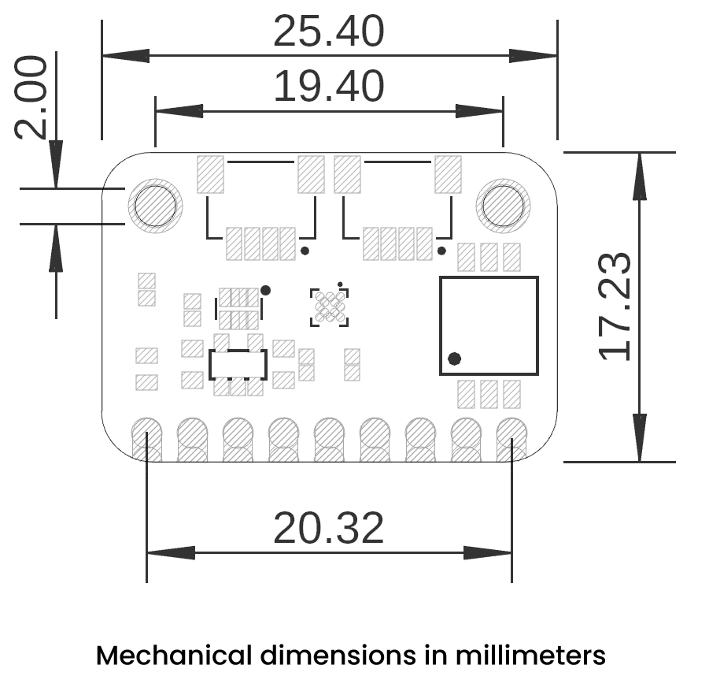

<!--
# README_TEMPLATE.md
Este archivo sirve como entrada para generar un PDF técnico estilo datasheet.
Edita las secciones respetando el orden, sin eliminar los encabezados.
-->
 <!-- logo -->

# BMM150 Magnetometer Module

## Introduction

The BMM150 is a compact, ultra-low-power 3-axis digital magnetometer designed for accurate orientation sensing, electronic compass applications, and inertial navigation. Its versatile I²C and SPI interfaces ensure easy integration with popular platforms such as Arduino, ESP32, and Raspberry Pi. Based on Bosch Sensortec's advanced technology, the BMM150 provides high precision and low power consumption, making it ideal for wearable devices, drones, and robotics.

## Functional Description

The BMM150 measures the magnetic field in three perpendicular axes (X, Y, Z), allowing precise heading calculation in static and dynamic environments. It compensates for soft and hard iron distortions and can be used in combination with an accelerometer and gyroscope for sensor fusion applications (e.g., 9DoF IMU).

- Measurement Range: ±1300 µT (X, Y axis), ±2500 µT (Z axis)
- Output Data Rate: Up to 30 Hz (configurable)
- Communication Interface: I²C (up to 400 kHz) or SPI (up to 10 MHz)
- Supply Voltage: 1.8V to 3.6V (typically 3.3V)

## Electrical Characteristics & Signal Overview

- Operating Voltage: 1.8V to 3.6V
- Interface Logic Level: 3.3V
- Typical Current Consumption: 170 µA during normal mode
- Standby Current: Below 1 µA to minimize battery drain and enhance energy efficiency
- Communication Interfaces: I²C and SPI (hardware selectable)

## Applications

- Electronic compass
- Augmented reality (AR) and virtual reality (VR)
- Robotics and drones (UAV)
- Navigation systems (GNSS enhancement)
- Wearable tracking devices

## Pin & Connector Layout

| Pin   | Name     | Description                           |
|-------|----------|---------------------------------------|
| 1     | VCC      | 3.3V supply input                     |
| 2     | GND      | Ground                                |
| 3     | SDA/MOSI | I²C data / SPI MOSI                   |
| 4     | SCL/SCK  | I²C clock / SPI clock                 |
| 5     | CSB      | SPI chip select (active low)         |
| 6     | SDO/SA0  | SPI MISO / I²C address select         |

## Settings

### Interface Overview

| Interface | Signals / Pins         | Typical Use                         |
|----------|------------------------|-------------------------------------|
| Power    | VCC, GND               | Power supply                        |
| I²C      | SDA, SCL               | Communication with MCU              |
| SPI      | MOSI, MISO, SCK, CSB   | High-speed SPI communication        |

### Supports

| Symbol | I/O   | Description                                  |
|--------|-------|----------------------------------------------|
| VCC    | Input | Power supply (3.3V)                          |
| GND    | GND   | Ground reference                             |
| SDA    | I/O   | I²C Data / SPI MOSI                          |
| SCL    | I     | I²C Clock / SPI SCK                          |
| CSB    | I     | SPI Chip Select (Active Low)                |
| SDO    | O     | SPI MISO / I²C address selector              |

## Block Diagram

## Dimensions

## Usage

Compatible with:

- Arduino UNO / Nano
- ESP32 / ESP8266
- Raspberry Pi / RP2040 boards
- STM32, CH32V, and other I²C/SPI capable MCUs

## Downloads

- [Datasheet - BMM150 (Bosch)](https://www.bosch-sensortec.com/media/boschsensortec/downloads/datasheets/bst-bmm150-ds000.pdf)
- [Example Code - Arduino](docs/bmm150_arduino_example.zip)
- [Schematic PDF](docs/schematic.pdf)

## Purchase

- [Buy from UNIT Electronics](https://www.uelectronics.com)