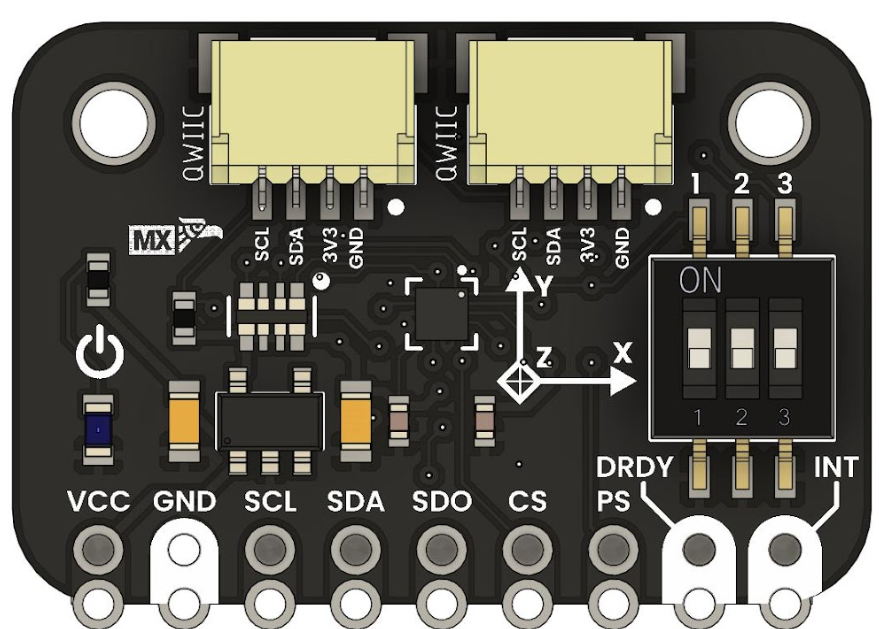
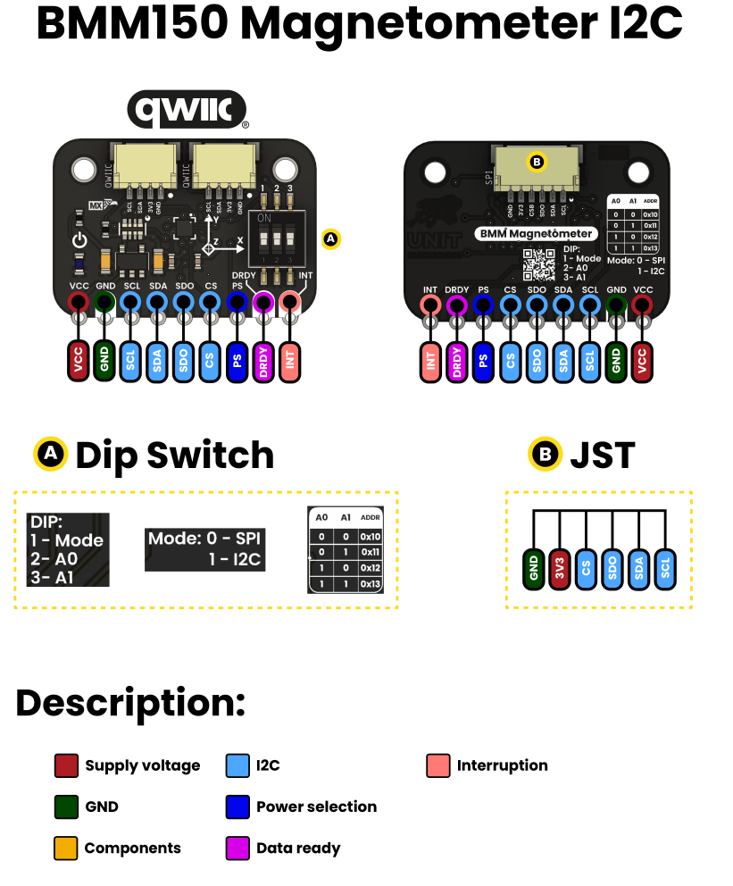
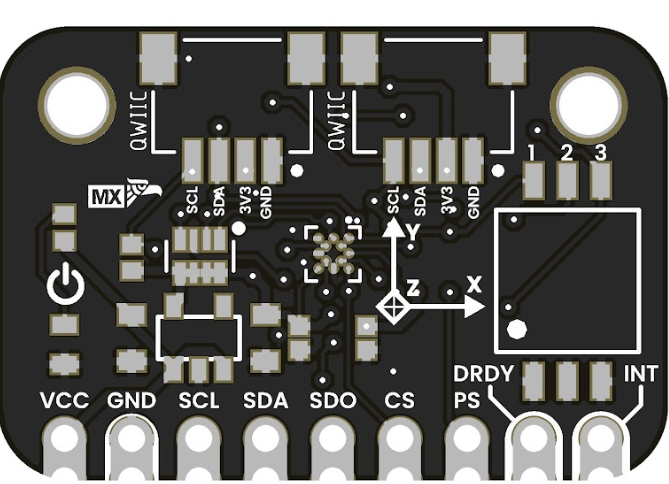

<!--
# README_TEMPLATE.md
Este archivo sirve como entrada para generar un PDF técnico estilo datasheet.
Edita las secciones respetando el orden, sin eliminar los encabezados.
-->
 <!-- logo -->

# UNIT Buzzer Module

## Introduction
The BMM150 is a compact, ultra-low-power 3-axis digital magnetometer designed for precise magnetic field sensing. It is ideal for applications such as electronic compasses, inertial navigation, and orientation detection in embedded systems. Supporting both I²C and SPI interfaces, the BMM150 integrates easily with popular microcontrollers like Arduino, ESP32, and Raspberry Pi. Its efficient power consumption and robust performance make it an excellent choice for portable devices, IoT projects, and wearable technology.

## Functional Description

-  3-axis digital magnetometer
-  I²C and SPI interfaces
-  Ultra-low power consumption
-  High sensitivity and resolution

## Electrical Characteristics & Signal Overview

- Supply Voltage: 3.3V
- Operating Current: 0.5 mA (typical)

## Applications

- Electronic compasses
- Inertial navigation systems
- Orientation detection
- Augmented reality
- Robotics
- Wearable technology
- IoT devices
- Smart home applications

## Features
- Axes: 3 (X, Y, Z)
- Measurement Range: ±1300 µT  
- Resolution: ~0.3 µT  
- Power Consumption:  
- Interfaces:  
- Supply Voltage: 3.3 V  
- Operating Temperature:  
- Additional Signals:  
    - DRDY (Data Ready)  
    - INT (Programmable Interrupt)  
    - SDO/ADDR (I²C address select / SPI MISO)

## Pin & Connector Layout

| PIN     | Description                    |
|---------|--------------------------------|
| VCC     | MCU logic voltage (3.3V) |

## Settings

### Interface Overview

| Interface  | Signals / Pins      | Typical Use                                         |
|------------|---------------------|-----------------------------------------------------|
| -          | -                   | -                                                   |

###  Supports 

| Symbol | I/O   | Description                         |
| ------ | ----- | ----------------------------------- |
| -      | -     |  Power supply (3.3V)                  |

## Block Diagram

## Dimensions

## Usage

Works with:

- Arduino AVR
- Raspberry Pi RP2040
- ESP32

## Downloads

- [Schematic PDF](../hardware/)

## Purchase

- [Buy from UNIT Electronics](https://www.uelectronics.com)